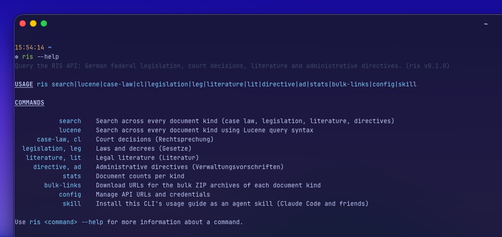

# RIS CLI 🔖

**Unofficial CLI for the [NeuRIS Portal API](https://docs.rechtsinformationen.bund.de/)**

- 🔍 Searches legislation, court decisions, literature, and directives
- 📜 Accepts an ELI as a work, an expression, a manifestation, URL, or the abbreviation of a law
- 🔐 Profiles for local, staging, and testphase, with credentials referenced from 1Password
- 🧰 Output as table when running an interactive session, or JSON when piped
- 🤖 Agent skill included!

> [!NOTE]
>
> This is an unofficial, personal side project. It is not a product of the NeuRIS project. The CLI only reads from the public API.

> [!CAUTION]
>
> The CLI is entirely vibe coded and poorly tested 😬



## Installation

You need [Node](https://nodejs.org) 26 or newer and [pnpm](https://pnpm.io) 11 or newer. To store credentials as 1Password references, you also need the [1Password CLI](https://developer.1password.com/docs/cli/) (`brew install 1password-cli`).

```sh
git clone git@github.com:andreasphil/ris-cli.git
cd ris-cli
pnpm install
pnpm build
pnpm link --global # puts `ris` on your PATH
```

As an alternative to `pnpm link`, put a symlink to the binary in a directory that is already on your `PATH`:

```sh
ln -s "$PWD/bin/ris.mjs" ~/.local/bin/ris
```

To test the installation, run `ris stats`. You can also use the CLI without installation: run `node bin/ris.mjs …` or `pnpm dev …`.

### Uninstalling

```sh
pnpm unlink --global            # or: rm ~/.local/bin/ris
rm -rf ~/.config/ris-cli        # profiles and default
```

Then delete the cloned repository.

## Usage

`ris --help` shows all commands. `ris <command> --help` shows the description and the flags of one command.

### Profiles and credentials

A profile contains the API URL and optional credentials. To use a profile for one command, add `--profile <name>`. Without this flag, the CLI uses the default profile from the config file. If there is no default profile, the CLI uses `http://localhost:8080`.

The CLI has three built-in profiles: `local`, `staging`, and `testphase`. You can add your own profiles. The config file is at `$XDG_CONFIG_HOME/ris-cli/config.json` (usually: `~/.config/ris-cli/config.json`).

```sh
ris config list                    # show profiles and which is the default
ris config set prod --url <url>    # change a profile
ris config use testphase           # set the default
ris config check                   # verify the URL and credentials actually work
ris config path                    # where the config file lives
```

The config file does not contain credentials. It contains 1Password secret references. For each request, the CLI reads the secrets with `op read`.

```sh
ris config set staging \
  --url https://ris-portal-staging.dev.tech.digitalservice.dev \
  --user my.name@digitalservice.bund.de \
  --password-ref "op://Employee/ris-staging/password"
```

## Development

The CLI is written in [TypeScript](https://www.typescriptlang.org). In development, Node runs the source code directly, without a build step. All tasks are [pnpm](https://pnpm.io) scripts:

```sh
pnpm dev …            # run the CLI from source, e.g. pnpm dev stats
pnpm test             # run tests (pnpm test:watch to keep them running)
pnpm typecheck        # tsc --noEmit
pnpm style:check      # formatting and lints (pnpm style:fix to apply)
pnpm build            # compile to dist/, which bin/ris.mjs loads
pnpm sync-spec        # refresh spec/openapi.json and regenerate API types
```

If a backend runs on `localhost:8080`, `pnpm sync-spec` uses the spec of this backend. Otherwise, it uses the published spec. The CLI also uses two `@Hidden` endpoints that the spec does not declare:

- `work-example` (for `ris leg versions`)
- `translatedLegislation` (for `ris leg translations`).

## Credits

This app uses a number of open source packages listed in [package.json](./package.json).

Thanks 🙏
